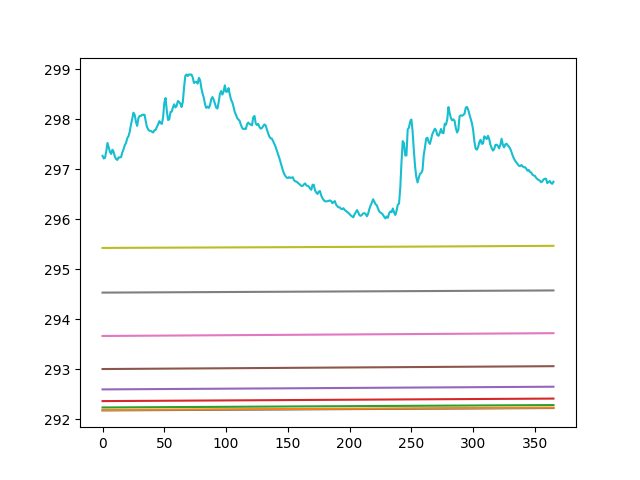

# GOTM_ISIMIP3_validation

For GOTM simulations for ISIMIP3 global lake simulation (more details [here](https://github.com/icra/ISIMIP_Lake_Sector) ), 7 water quality/physical variables were produced: watertemp (water temperature profile for 10 levels), surftemp (surface temperature), bottemp (bottom temperature), icetemp (ice temperature), icethick (ice thickness), latentheatf (latent heat flux), sensheatf (sensible heat flux). In order to validate the data obtained in the simulation 3 figures different were created using ISIMIP3a data: 

## (i) a mean map for single-level variables (all except watertemp) for each decade chunk,      

In this case this figure shows 20CRv3-ERA5 simulation for bottom temperature for 1901-1910 decadal chunk.

## (ii) a map of a random day for single-level variables (all except watertemp for each decade chunk,

In this case this figure shows GSWP3-W5E5 simulation for sensible heat flux for 1997-03-22.

## and (iii) a profile for one random year of a random pixel for the watertemp variable 

In this case this figure shows 20CRv3-W5E5 simulation for the Lake Hulun (coordinates: 48.75,117.25; max depth: 19.81m) on the year 1931.

In this case this figure shows 20CRv3-W5E5 simulation for the Lake Kivu (coordinates: -2.25,29.25; max depth: 475m) on the year 1931.

In this case this figure shows 20CRv3-W5E5 simulation for the Lake Bosumtwi (coordinates: 6.75,-1.25; max depth: 22.41m) on the year 1931.

In this case this figure shows 20CRv3-W5E5 simulation for the Lake Mendota (coordinates: 43.25,-89.25; max depth: 25.3m) on the year 1931.
